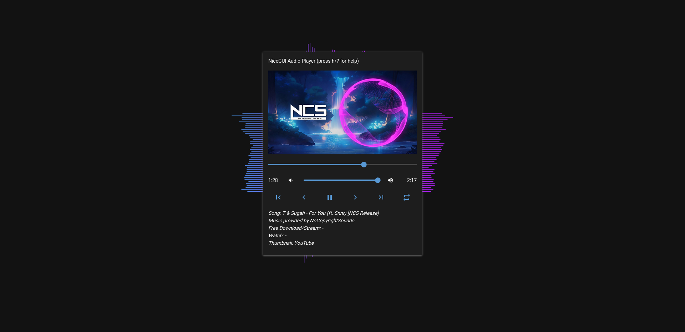

# Sample Audio Player using NiceGUI and Wave.js

This is just an experiment on how to create an audio player with [NiceGUI](https://github.com/zauberzeug/nicegui) and some nice [wave.js](https://github.com/foobar404/Wave.js/) animations.

Currently only playback of the sample song is possible, but this code is only there to provide a starting point if you need a Audio Player that is a bit more beautiful than the plain HTML5 player. So hack yourself into this project and create something even more beautiful.

Also, be happy that I did all the stuff to make the interactions with the invisible audio element possible. It was damn annoying. 

Still, the interaction with that slider is not working or kinda buggy. I'd like to move the slider somewhere and make the audio jump to that timestamp.

Tried it as follows, it is not working quite well. So if you have a fix or any further suggestions, please contribute, I'm happy to test and merge!

```python
# mousedown, does not work
slider = ui.slider(...).on(type="mousedown", handler=lambda: audio.seek(slider.value))

# Or mouseup, worked a bit better but it is still very unreliable due to the fast intervals in which I update the slider based on changes in the audio currentTime
# Respective line of code: audio.on("timeupdate", handler=update_slider)
slider = ui.slider(...).on(type="mouseup", handler=lambda: audio.seek(slider.value))

# Or using both, but that ended in Chaos and also in some audio bugs.
```

### How to use
In the music folder is a copyrightfree piece of music with the following attribution:
```
Song: T & Sugah - For You (ft. Snnr) [NCS Release]
Music provided by NoCopyrightSounds
Free Download/Stream: -
Watch: -
Thumbnail: YouTube
```

Start the app by simply calling `python3 app.py`